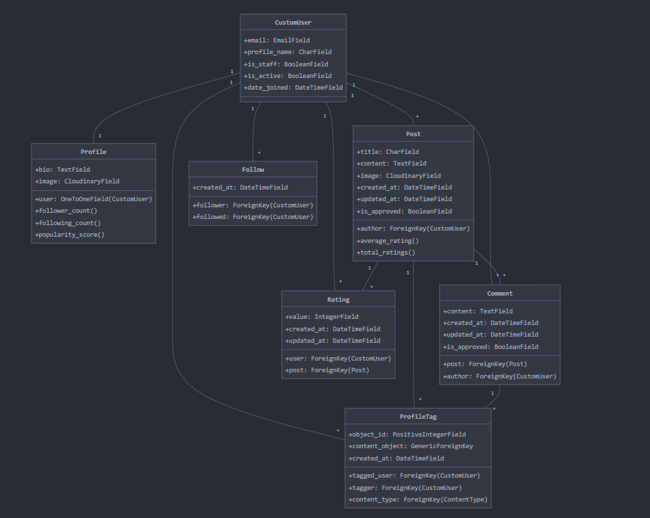

# 🚀 BlogClient Backend: Powering Your Social Blogging Platform

## 🌟 Quick Links
- [Live Project]() (Coming Soon!)
- [Project Board](https://github.com/users/Moonchichiii/projects/39)
- [API Documentation](docs/api_readme.md)
- [Deployment Guide](docs/deployment_guide.md)

## 🎯 Project Overview
BlogClient Backend is the powerhouse behind a dynamic social media blogging platform. Built with Django and DRF, it offers robust features for a seamless blogging experience.

### 🔑 Key Features
- Secure JWT-based authentication with 2FA
- Post creation, commenting, and user tagging
- Follow system and content discovery
- High-level security measures
- Efficient caching strategies
- Admin tools for content moderation

## 🏗️ Application Structure

```
blogclient_backend/
│
├── accounts/
├── profiles/
├── posts/
├── comments/
├── ratings/
├── tags/
├── followers/
│
├── blogclient_backend/
│   ├── settings.py
│   ├── urls.py
│   └── wsgi.py
│
├── static/
├── media/
│
├── manage.py
├── requirements.txt
└── README.md
```

## 📊 Class Diagram




## 🛠️ Tech Stack
- Django & Django REST Framework
- PostgreSQL
- JWT & Two-Factor Authentication
- Redis for caching
- Cloudinary for media storage

## 📦 Key Dependencies
- Django (5.0.6)
- Django REST Framework (3.14.0)
- Django Allauth (0.61.1)
- Django Cloudinary Storage (0.3.0)
- Django CORS Headers (4.3.1)
- Django Filter (24.2)
- Django REST Framework SimpleJWT (5.3.1)
- DJ Rest Auth (2.2.7)
- Gunicorn (22.0.0)
- OpenAI (1.35.10)
- Pillow (10.3.0)
- Psycopg2-binary (2.9.9)
- Whitenoise (6.7.0)
- Django Ratelimit (4.1.0)
- Django Two-Factor Auth
- Django Redis

## 🚀 Quick Start
1. Clone: `git clone https://github.com/yourusername/blogclient-backend.git`
2. Install: `pip install -r requirements.txt`
3. Migrate: `python manage.py migrate`
4. Run: `python manage.py runserver`

## 🧪 Testing
We take testing seriously to ensure reliability and performance. See our [testing guide](docs/testing_guide.md) for details on:
- Unit and integration tests
- Coverage reports
- Performance testing with Locust
- Security testing

## 🔒 Security Features
- Two-Factor Authentication (2FA)
- JWT with short expiry and refresh tokens
- Rate limiting to prevent abuse
- CORS configuration
- Content Security Policy (CSP)
- HTTPS enforcement

## 📦 Deployment
This project is designed to be deployed on Heroku. Before deploying, ensure you've configured your settings correctly:

1. Update `ALLOWED_HOSTS` in `settings.py`
2. Configure environment variables (see [Deployment Guide](docs/deployment_guide.md))
3. Set `DEBUG = False` for production

For a full deployment walkthrough, check our [Deployment Guide](docs/deployment_guide.md).

## 🔮 Future Enhancements
- AI-powered chatbot using OpenAI API
- Advanced analytics dashboard
- Real-time notifications

## 🤝 Contributing
We welcome contributions! Please check our [contributing guidelines](CONTRIBUTING.md).

## 📜 License
This project is licensed under the MIT License - see the [LICENSE.md](LICENSE.md) file for details.

---

Built with ❤️ 